# AWS Cloud Infrastructure

Hands-on AWS infrastructure project demonstrating VPC design, EC2 auto scaling, load balancing, and serverless event-driven architecture using EventBridge, Lambda, and SNS. Managed as code with Terraform.

---

## Architecture

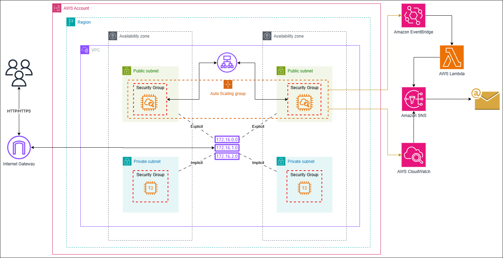

### Notification flows

#### CloudWatch

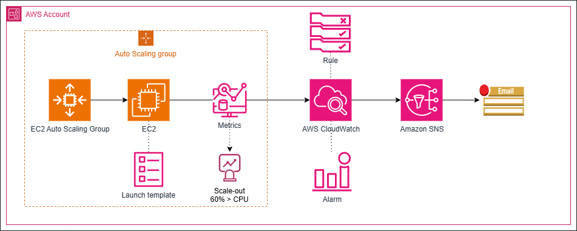

#### EventBridge

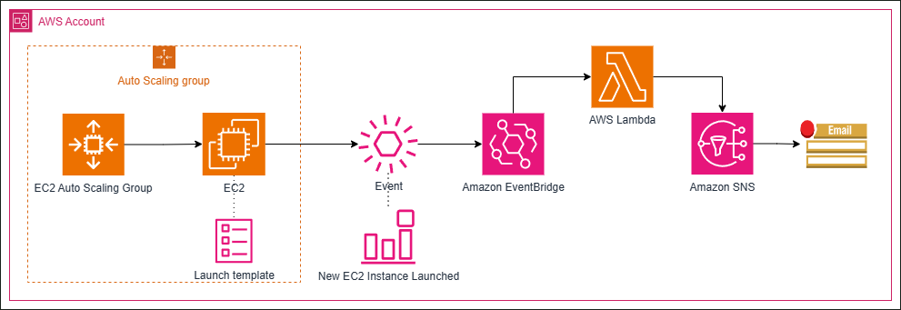

---

## Technologies

- **AWS VPC** — isolated network with public and private subnets across 2 availability zones
- **AWS EC2** — auto scaled instances managed by a launch template
- **AWS ALB** — application load balancer distributing traffic across EC2 instances
- **AWS Auto Scaling** — automatically adjusts EC2 capacity based on CPU utilization
- **AWS EventBridge** — event rule that detects new EC2 instance launches
- **AWS Lambda** — Python function triggered by EventBridge to send notifications
- **AWS SNS** — topic that delivers email notifications to subscribers
- **AWS CloudWatch** — alarm that triggers when CPU exceeds 60%
- **Terraform** — infrastructure as code managing all resources

---

## Infrastructure Overview

### Networking

A VPC (`10.0.0.0/16`) with 2 public and 2 private subnets spread across availability zones `sa-east-1a` and `sa-east-1c`. Public subnets are connected to an Internet Gateway via a route table. EC2 instances run in private subnets.

### Compute

An Auto Scaling Group manages EC2 instances (`t2.micro`) using a launch template with a defined AMI, key pair, and security group. The ASG has a minimum of 1, desired of 1, and maximum of 3 instances.

### Load Balancing

An Application Load Balancer sits in the public subnets, listening on port 80 (HTTP) and forwarding traffic to the EC2 target group with health checks enabled.

### Event-Driven Notifications

When the ASG launches a new EC2 instance, EventBridge detects the event and triggers a Lambda function. The Lambda function uses an SNS destination to deliver an email notification to the subscriber.

### Monitoring

A CloudWatch alarm monitors average CPU utilization of the ASG. When CPU exceeds 60%, it triggers an SNS notification via email.

---

## Prerequisites

- [Terraform](https://developer.hashicorp.com/terraform/install) >= 6.0
- [AWS CLI](https://aws.amazon.com/cli/) configured with valid credentials

```bash
aws configure
```

---

## Usage

```bash
# Clone the repository
git clone git@github.com:your-username/aws-cloud-infrastructure.git
cd aws-cloud-infrastructure/terraform

# Copy the example variables file and fill in your own values

copy terraform.tfvars.example terraform.tfvars

# Initialize Terraform

terraform init

# Preview changes

terraform plan

# Apply infrastructure

terraform apply

```

---

## Project Structure

```

aws-cloud-infrastructure/
├── docs/
│ ├── AWS-Architecture.png
│ ├── AWS-CloudWatch-Notification.png
│ ├── AWS-Event-Notification.png
│ └── screenshots/
│ ├── vpc.png
│ ├── asg-details.png
│ ├── asg-activity.png
│ ├── asg-instancemanagement.png
│ ├── asg-metrics.png
│ ├── alb-network.png
│ ├── alb-listenersrules.png
│ ├── eventbridge-eventpattern.png
│ ├── lambda-triggers.png
│ ├── lambda-destinations.png
│ ├── sns-subscriptions.png
│ ├── cloudwatch-definition.png
│ ├── cloudwatch-metrics.png
│ ├── email-cloudwatch.png
│ └── email-eventec2launched.png
├── lambda/
│ ├── lambda_function.py
│ └── lambda_function.zip
└── terraform/
├── providers.tf
├── vpc.tf
├── subnets.tf
├── internet_gateway.tf
├── route_tables.tf
├── alb.tf
├── launch_template.tf
├── asg.tf
├── sns.tf
├── lambda.tf
├── eventbridge.tf
└── cloudwatch_alarms.tf

```

---

## Screenshots

### VPC & Networking

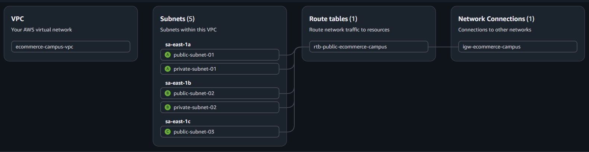

### Auto Scaling Group

#### ASG Details

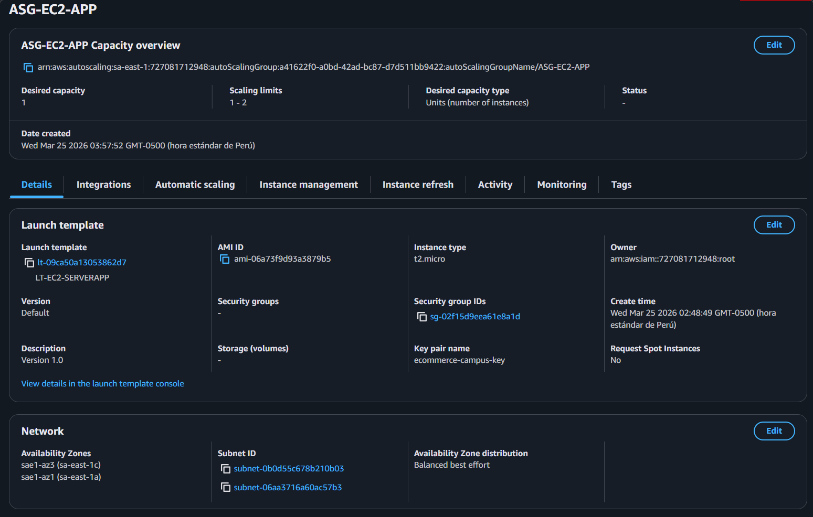

#### ASG Activity

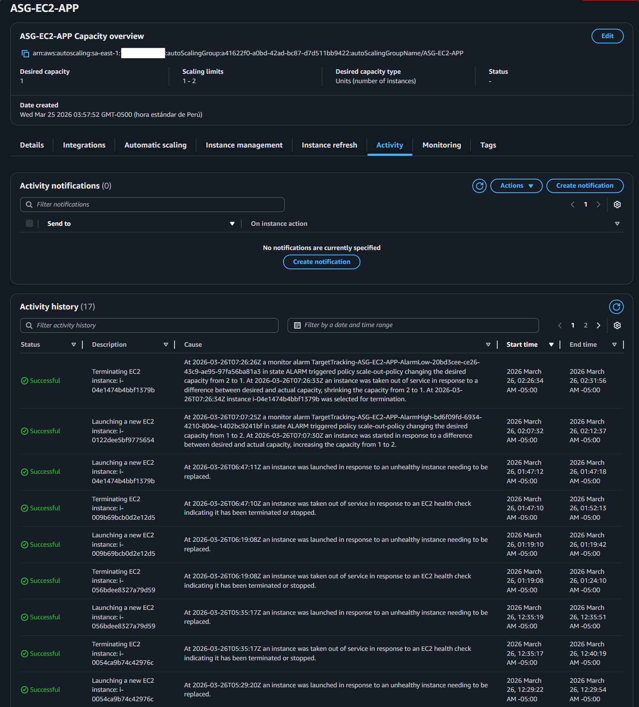

#### ASG Instance Management

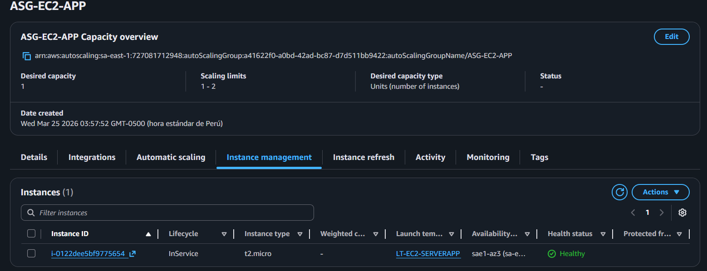

#### ASG Metrics

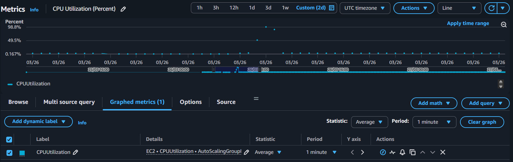

### Application Load Balancer

#### Network

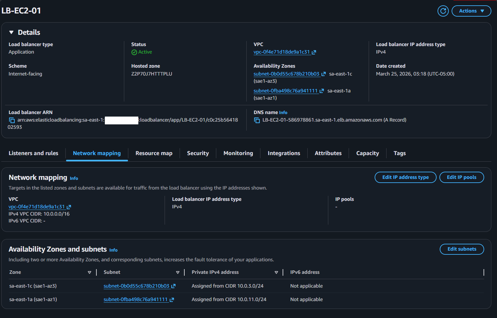

#### Listeners and Rules

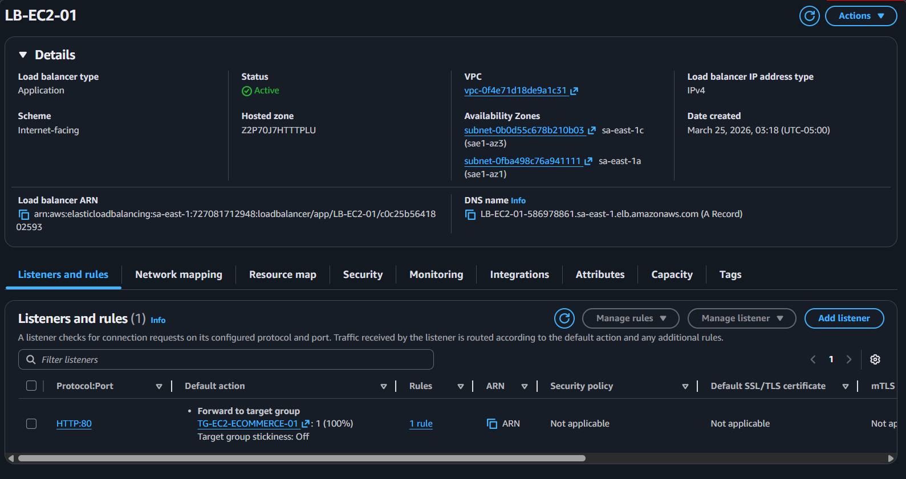

### EventBridge

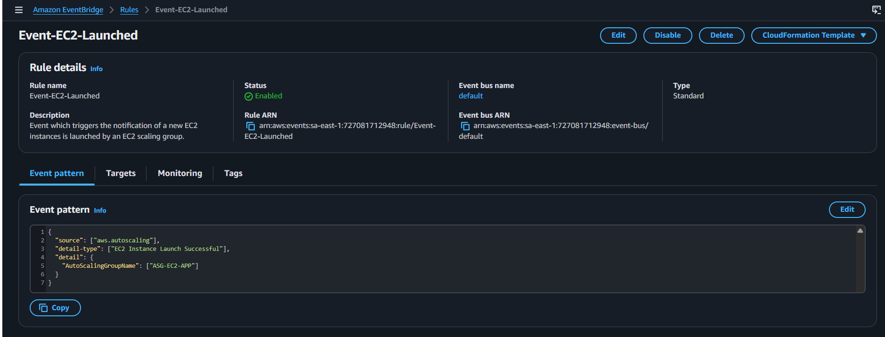

### Lambda

#### Triggers

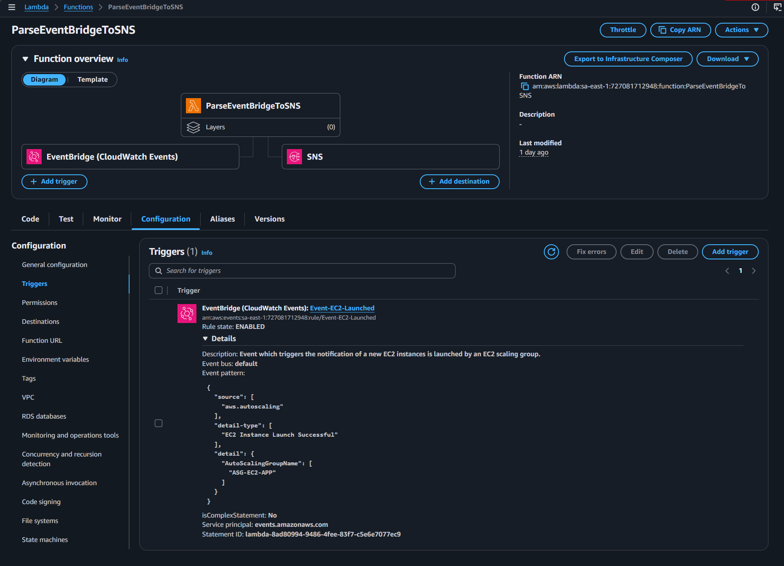

#### Destinations

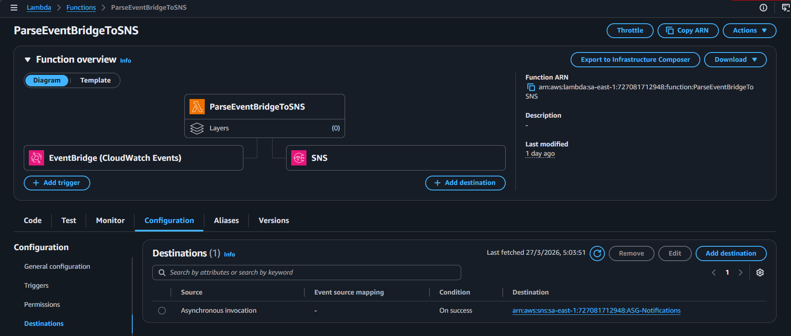

### SNS

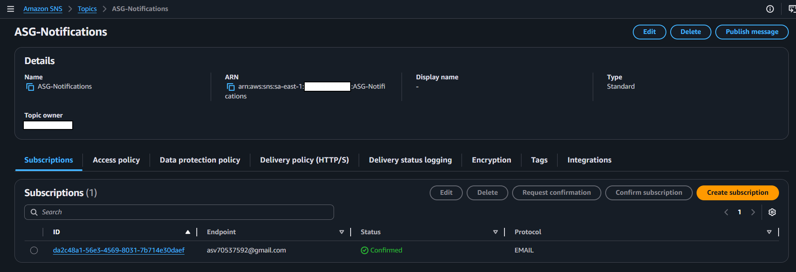

### CloudWatch

#### CloudWatch Definition

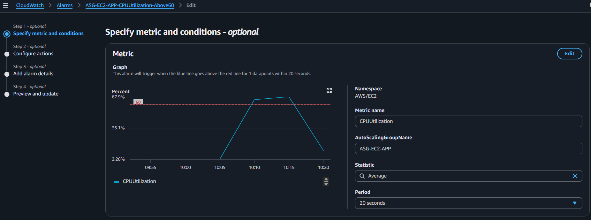

#### CloudWatch Metrics

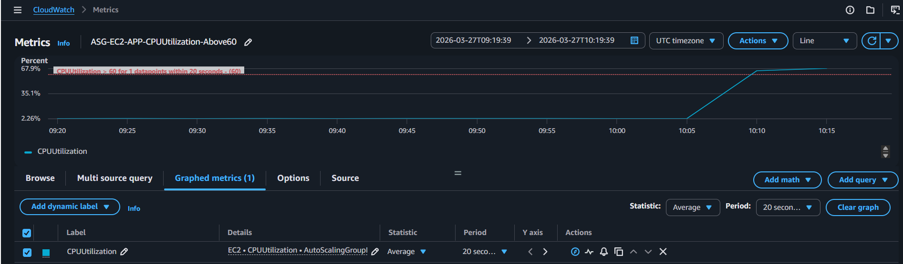

### Email Notifications

#### CloudWatch Alert

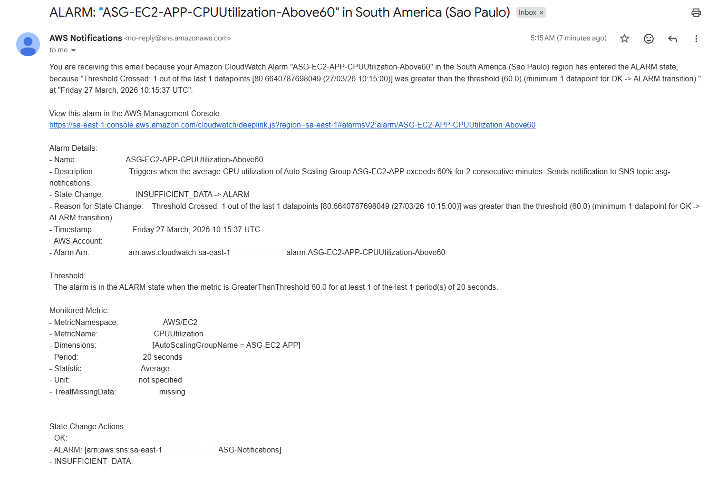

#### EventBridge Alert

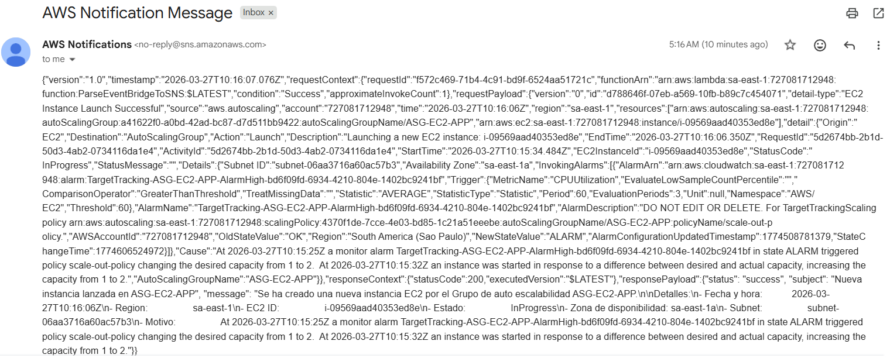

### Security Group

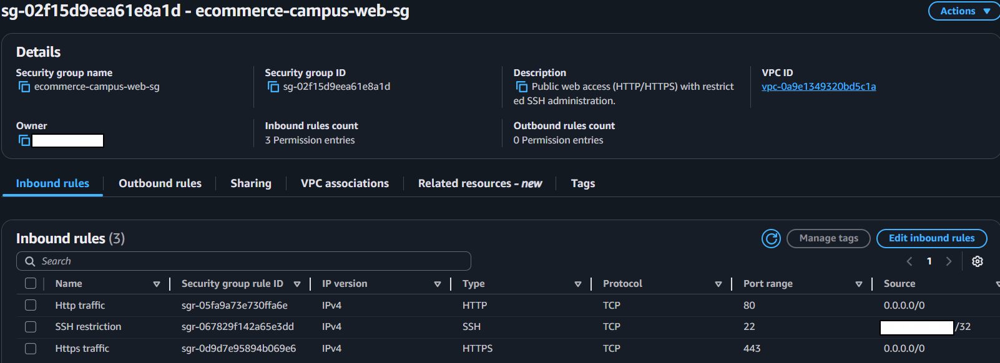

---

## Author

**Angel Sechar**
[GitHub](https://github.com/Angel-Sechar) · [LinkedIn](https://www.linkedin.com/in/angel-sechar-valdez/)

```

```
